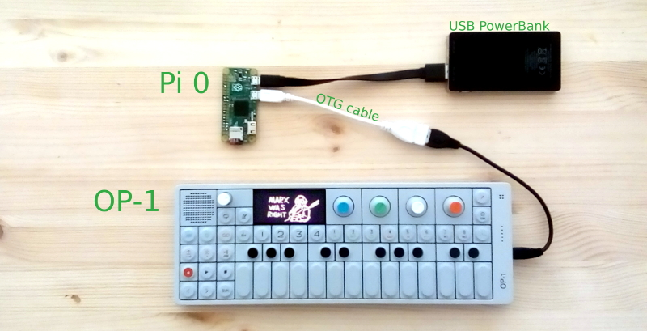

# OP1vacation

This is just a simple script to copy new album tracks, samples, files from
Teenage Engineering's OP-1 over to a Raspberry Pi Zero. Motivation was to have a
method to offload albums and samples from the OP-1 while on vacation, without
having to lug around a laptop. You might be able to do the same with a
smartphone that supports USB OTG but I do not have such a thing. So...

**Warning: This is not the most stable of systems for keeping files. Use at your
own risk**

## Use

Connect USB battery to Raspberry Pi, setup OP-1 into disk mode and connect it
to the USB of the Raspberry Pi. New files will be copied from OP-1 to SD card of
Raspberry Pi into a directory named ``"YYMMDD_HHMMSS"``. Copy could take up to
4 minutes.

When copy is complete the **end copy** ACT LED sequence will loop. See code for
details.

## Setup

Login to your Raspberry Pi and copy the ``sync.sh`` script and configure it to
run as root upon each boot:

    wget https://raw.githubusercontent.com/cyphunk/op1vacation/master/sync.sh -O /home/pi/sync.sh
    sudo su
    echo "/home/pi/sync.sh &" >> /etc/rc.local

## Options

### Test locally

On linux systems executing ``sync.sh`` and connecting a OP-1 should also work.

### Use 3rd FAT partition

New files can be access on the SD card by placing the SD card into a reader on
a Linux system. However, if you ad a 3rd fat partition to the Raspberry Pi SD
card you can also access the files in OSX systems. To fascilitate this option
the script will copy all new OP1 files to the 3rd partition if it exists.

### Run action after copy

If the ``afterallcopied.sh`` script is found it will be run after files have
been copied. The current script attempts to transcode new album tracks into
mp3's.

## License

License: Non-White-Heterosexual-Male

If you are not a white heterosexual male you are permitted to copy, sell and use
this work in any manner you choose without need to include any attribution you
do not see fit. You are asked as a courtesy to retain this license in any
derivatives but you are not required. If you are a white heterosexual male you
are provided the same permissions (reuse, modification, resale) but are
required to include this license in any documentation and any public facing
derivative. You are also required to include attribution to the original author
or to an author responsible for redistribution of a derivative.
